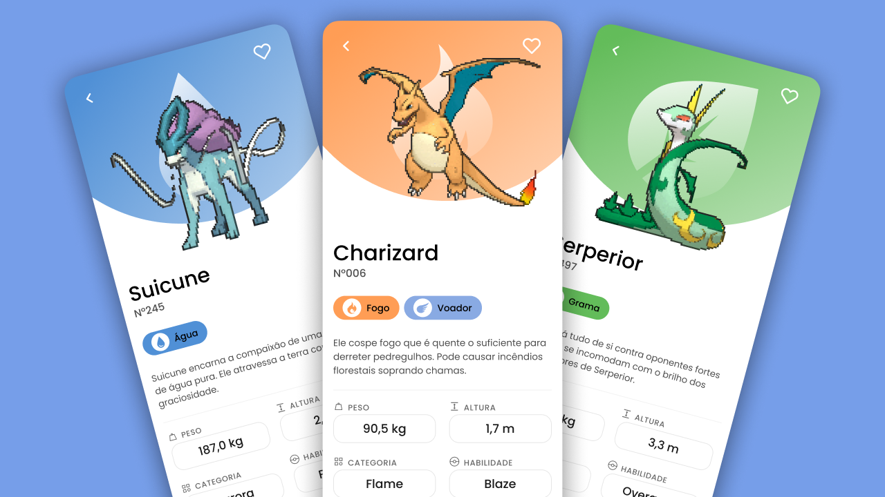
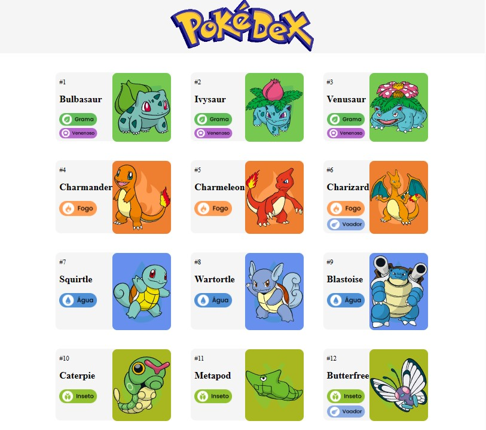

<h1 align="center">PokeAPI</h1>

Este repositório contém uma aplicação web que consome a PokeAPI, uma API pública que fornece dados sobre Pokémon, como seus nomes e tipos. A aplicação exibe os dados dos Pokémon em um formato amigável e interativo, permitindo que os usuários explorem e conheçam mais sobre essas criaturas incríveis. O projeto foi criado com o objetivo de aprimorar minhas habilidades em HTML, CSS puro e responsividade. O projeto utiliza as metodologias de design responsivo e mobile first para garantir uma experiência de usuário intuitiva tanto em dispositivos móveis quanto em desktops.

[Clique aqui para acessar o projeto](https://thiagocaitanol.github.io/pokedex-pokeApi/)

  

<h2>Tecnologias Utilizadas</h2>
<ul>
    <li>HTML5</li>
    <li>CSS</li>
    <li>JavaScript</li>
</ul>
<h2>Funcionalidades</h2>
<ul>
    <li>A responsividade foi implementada utilizando a metodologia Mobile First, o que significa que o layout e o design da página foram desenvolvidos pensando primeiro nos dispositivos móveis.</li>
    <li>Exibição de informações detalhadas sobre cada Pokémon, incluindo nome, tipos e imagem.</li>
    <li>Uso de elementos HTML semânticos para estruturar corretamente o conteúdo, proporcionando uma acessibilidade adequada e melhorando a otimização para mecanismos de busca.</li>
    <li>Utilização de técnicas de design modernas, como o uso de flexbox e grid para criar um layout flexível e responsivo.</li>
</ul>

<h2>Como utilizar</h2>
<ol>Clone este repositório em seu computador:</ol>
<pre><code class="language-bash">
  git clone https://github.com/ThiagoCaitanol/pokedex-pokeApi
 </code></pre>
<ol>Abra o arquivo index.html no navegador de sua preferência.</ol>

<h2>Contribuição</h2>
Contribuições são bem-vindas! Se você deseja contribuir, siga as instruções abaixo:

<ol>Faça um fork deste repositório.</ol>
<ol>Crie um branch com suas alterações:</ol>

<ol>Clone este repositório em seu computador:</ol>
<pre><code class="language-bash">
  git checkout -b minha-alteracao
</code></pre>

<ol>Faça commit das suas alterações:</ol>

<pre><code class="language-bash">
  git commit -m "Descrição da minha alteração"
</code></pre>

<ol>Faça push para o branch:</ol>

<pre><code class="language-bash">
  git push origin minha-alteracao
</code></pre>

<ol>Abra um pull request no repositório original.</ol>

<h2>Autor</h2>

Este projeto foi criado por Thiago Caitano como parte de um estudo pessoal em CSS e um desafio para plataforma DIO.

Segue o link do repositorio do desafio: https://github.com/digitalinnovationone/js-developer-pokedex

Segue o link do figma utilizado no projeto: https://www.figma.com/file/iTJfWnm4bGwT7qBf8xd71A/Pok%C3%A9dex-%2F-Pok%C3%A9mon-App-(Community)?type=design&node-id=95-236&t=cw06qqvyBYG9b4JH-0

<h2>Licença</h2>
Este projeto está licenciado sob a licença MIT. Consulte o arquivo LICENSE para obter mais informações.

